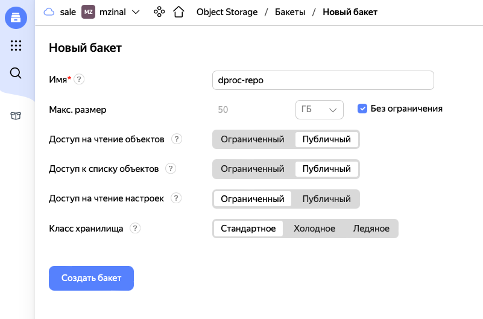
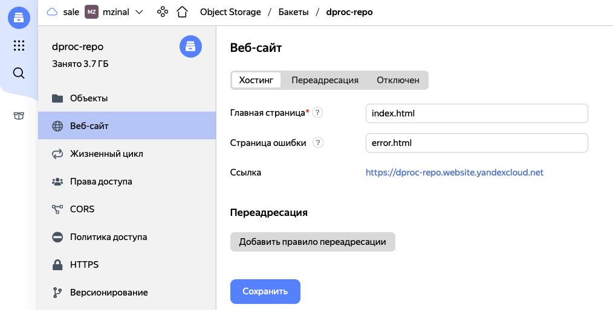
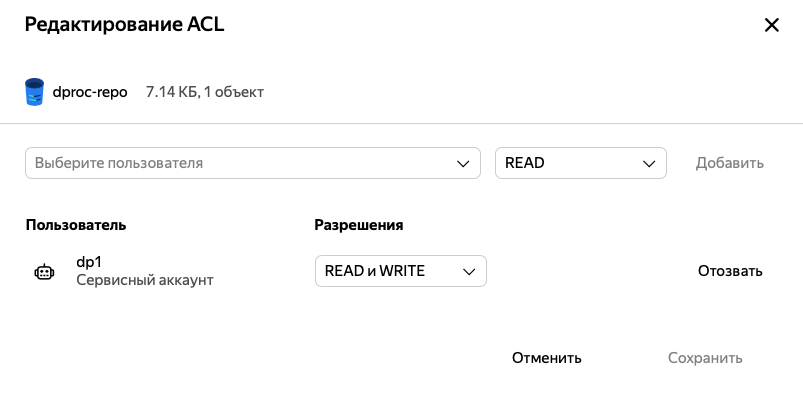

# Установка и обновление пакетов Python на кластерах Data Proc

При использовании PySpark часто требуется возможность установки дополнительных пакетов и обновления версий уже установленных пакетов Python на кластерах Data Proc. Решение этой задачи применительно к Yandex Data Proc сопряжено с некоторыми трудностями:
* В отличие от типичных сред "ноутбуков" Jupyter или Zeppelin, активно используемых в среде специалистов по Data Science, кластерная среда Data Proc требует поддержания синхронного состава пакетов и их версий на всех узлах кластера.
* Кластеры Data Proc во многих случаях желательно изолировать от внешних сетей, исключив бесконтрольный доступ в интернет, что затрудняет доступ к стандартным репозиториям пакетов Python.
* Штатные инструменты управления пакетами Python (`conda`, `mamba`) имеют достаточно низкую производительность, поэтому их использование для автоматического обновления узлов кластера оказывается непрактичным.

В этом документе предложено два альтернативных подхода к организации управления пакетами Python на кластерах Data Proc:
1. Локальный репозиторий - создание и использование ограниченной копии репозитория пакетов `conda`, содержащего только нужные для работы пакеты.
2. Образ среды - создание и использование образа файловой системы с необходимым набором пакетов, загружаемого на узлы кластера Data Proc при их инициализации.

Каждый из подходов предполагает предварительное создание среды Python с необходимыми составом библиотек в рамках временного кластера Data Proc. Созданную среду Python далее необходимо автоматизированно распространить на узлах рабочих кластеров Data Proc, что обеспечивается скриптами инициализации, выполняемыми на каждом узле при создании кластера, а также при добавлении узлов в динамически масштабируемый кластер.

## Создание среды Python с требуемым составом и версиями библиотек

Для создания среды Python с нужными библиотеками используется временный кластер Data Proc, имеющий доступ в интернет для скачивания дистрибутивов из репозиториев пакетов `conda`.

Во временном кластере может присутствовать единственный мастер-узел. Количество выделенных ресурсов мастер-узла определяет скорость выполнения операций подготовки среды Python, некоторые из которых используют все доступные процессорные ядра и чувствительны к объему доступной оперативной памяти. Рекомендуется использование не менее 8 vCPU и 16 Гбайт оперативной памяти.

Ориентировочные параметры можно посмотреть в [примере скрипта для создания временного кластера](dp-pyenv-prepare.sh). Перед использованием примера скорректируйте настройки в [скрипте с опциями](dp-pyenv-options.sh), либо укажите настройки непосредственно в своей копии скрипта для создания кластера.

После создания кластера необходимо войти клиентом SSH на мастер-узел кластера от имени пользователя `ubuntu`. Дальнейшие действия должны производиться от имени пользователя `root`, переключение пользователя может быть выполнено с помощью команды `sudo su -`.

Окружение Python на узлах кластера Data Proc управляется с помощью инструмента `conda` и размещено в каталоге `/opt/conda`. Перед установкой свежих версий пакетов Python целесообразно обновить уже установленные пакеты, что можно выполнить с помощью следующих команд:

```bash
conda update -c conda-forge -n base --yes conda
conda update -c conda-forge --all --yes
```

> **Примечание.** При возникновении ошибок таймаута сетевого доступа к серверам репозиториев Conda необходимо повторить команду, завершившуюся с ошибкой.

Опционально можно заменить штатный алгоритм разрешения зависимостей `conda` (который работает очень медленно и иногда не может построить план установки) на более современный вариант, [рекомендуемый разработчиками Conda](https://www.anaconda.com/blog/a-faster-conda-for-a-growing-community):

```bash
conda install -c conda-forge -n base --yes conda-libmamba-solver
conda config --set solver libmamba
```

Далее можно установить необходимые дополнительные пакеты Python, например:

```bash
conda install --yes \
  'catboost>0' \
  'lightgbm>0' \
  'nltk>0' \
  'prophet>0' \
  'seaborn>0' \
  'unidecode>0' \
  'psycopg2>0'
```

При установке можно также указать требования к необходимым версиям пакетов, например:

```bash
conda install -c conda-forge --yes \
  'catboost==1.0.6' \
  'lightgbm==3.2.1' \
  'nltk==3.7' \
  'prophet==1.1.2' \
  'seaborn==0.12.2' \
  'unidecode==1.2.0' \
  'psycopg2==2.9.3'
```

На этом этапе на мастер-узле временного кластера Data Proc в каталоге `/opt/conda` сформировано окружение Python, совместимое с Data Proc и содержащее необходимые версии пакетов.

> **Примечание.** Окружения для образов Data Proc версий 2.0 и 2.1 не совместимы друг с другом из-за различий в версиях системных библиотек.

## Вариант 1 - Локальный репозиторий

Общая логика:
1. Создаем структуру файлов частичной реплики репозитория пакетов Conda, содержащего только необходимые пакеты.
2. Размещаем частичную реплику репозитория пакетов в объектном хранилище Yandex Cloud, и настраиваем прямой доступ по протоколу HTTP.
3. Готовим скрипт инициализации, выполняющий установку необходимых пакетов из созданного локального репозитория.

### 1.1 Создание частичной реплики репозитория

Необходимо установить пакет `conda-build`, который требуется для выполнения команды `conda index` (см. далее):

```bash
conda install -c conda-forge --yes conda-build
```

Чтобы подготовить структуру файлов локального репозитория, содержащего установленные в текущей среде Python пакеты, используется приведенный ниже скрипт:

```bash
REPO=/Mirror/conda1
mkdir -pv ${REPO}
(cd /opt/conda/pkgs && ls *.{conda,bz2}) | while read fname; do
  url=`grep "$fname" /opt/conda/pkgs/urls.txt`
  if [ ! -z "$url" ]; then
    part1=`dirname $url`
    arch=`basename $part1`
    mkdir -pv ${REPO}/$arch
    cp -v /opt/conda/pkgs/$fname ${REPO}/$arch/
  fi
done
conda index ${REPO}
find ${REPO} -type d -name .cache | sort -u | while read x; do rm -rf $x; done
```

В результате в каталоге `/Mirror/conda1` будет подготовлена структура файлов и каталогов, которая может быть использована менеджером пакетом `conda` в качестве локального репозитория пакетов.

### 1.2 Копирование реплики в бакет Object Storage

Для организации сетевого доступа к файлам локального репозитория можно использовать бакет Yandex Object Storage, в котором включён режим публичного доступа и активирована опция Web-сайта, как показано на скриншотах ниже.





На созданный бакет также необходимо настроить права доступа от имени сервисного аккаунта, используемого временным кластером Data Proc, допускающие запись данных в бакет.



Для копирования локального репозитория с мастер-узла временного кластера в бакет Yandex Object Storage можно использовать приведённые ниже команды:

```bash
BUCKET=dproc-repo
cd /Mirror
sudo -u hdfs hdfs dfs -mkdir s3a://${BUCKET}/repos/
sudo -u hdfs hdfs dfs -copyFromLocal -d -t 20 conda1/ s3a://${BUCKET}/repos/
```

В результате в бакете `dproc-repo` (пример имени, фактическое имя будет отличаться) будет сформирован каталог `/repos/conda1/`, содержащий набор файлов репозитория Conda. Для описанного случая доступ к репозиторию по протоколу HTTP будет осуществляться через URL https://dproc-repo.website.yandexcloud.net/repos/conda1.

### 1.3 Использование локального репозитория в кластерах Data Proc

Для использования созданного локального репозитория в кластерах Data Proc необходимо подготовить скрипт инициализации, осуществляющий обновление и установку пакетов. Пример команд для скрипта инициализации:

```bash
CHANNEL='https://dproc-repo.website.yandexcloud.net/repos/conda1'
conda update -c ${CHANNEL} --override-channels --all --yes
conda install -c ${CHANNEL} --override-channels --yes conda-libmamba-solver
conda config --set solver libmamba
conda install -c ${CHANNEL} --override-channels --yes \
  'catboost==1.0.6' \
  'lightgbm==3.2.1' \
  'nltk==3.7' \
  'prophet==1.1.2' \
  'seaborn==0.12.2' \
  'unidecode==1.2.0' \
  'psycopg2==2.9.3'
```


Если, в дополнение к менеджеру пакетов `conda`, в окружение Python необходимо устанавливать пакеты с помощью инструмента `pip` (не рекомендовано), то для создания частичного зеркала может использоваться [специальный инструмент](https://pypi.org/project/python-pypi-mirror/). Локальное зеркало пакетов `pip` далее может быть использовано на рабочих кластерах Data Proc в скриптах инициализации, аналогично описанному выше варианту для `conda`.

## Вариант 2 - Образ среды


https://pypi.org/project/python-pypi-mirror/

В случае обновлении среды Python временно требуется обновить файл `zeppelin_python.py` в следующих точках:
* каталоге `/usr/lib/zeppelin/interpreter/python/python`
* архиве `python-interpreter-with-py4j-0.9.0.jar` в каталоге `/usr/lib/zeppelin/interpreter/python`
* архиве `spark-interpreter-0.9.0.jar` в каталоге `/usr/lib/zeppelin/interpreter/spark`

Актуальный вариант файла `zeppelin_python.py` размещен в [репозитории Zeppelin на Github](https://github.com/apache/zeppelin/blob/master/python/src/main/resources/python/zeppelin_python.py).

```bash
conda update -c conda-forge -n base --yes conda
conda update -c conda-forge --all --yes
conda install -c conda-forge -n base --yes conda-libmamba-solver
conda config --set solver libmamba
conda install -c conda-forge --yes conda-build
conda update -n base --yes conda
```

Образ Data Proc версии 2.0:

```bash
conda install -c conda-forge --yes \
  'catboost==1.0.6' \
  'lightgbm==3.2.1' \
  'nltk==3.7' \
  'prophet==1.1.2' \
  'seaborn==0.12.2' \
  'unidecode==1.2.0' \
  'psycopg2==2.9.3'
```

Образ Data Proc версии 2.1:

```bash
conda install -c conda-forge --yes \
  'catboost>0' \
  'lightgbm>0' \
  'nltk>0' \
  'prophet>0' \
  'seaborn>0' \
  'unidecode>0' \
  'psycopg2>0'
```


```bash
REPO=/Mirror/conda1
mkdir -pv ${REPO}
(cd /opt/conda/pkgs && ls *.{conda,bz2}) | while read fname; do
  url=`grep "$fname" /opt/conda/pkgs/urls.txt`
  if [ ! -z "$url" ]; then
    part1=`dirname $url`
    arch=`basename $part1`
    mkdir -pv ${REPO}/$arch
    cp -v /opt/conda/pkgs/$fname ${REPO}/$arch/
  fi
done
conda index ${REPO}
find ${REPO} -type d -name .cache | sort -u | while read x; do rm -rf $x; done
```

```bash
cd /Mirror
sudo -u hdfs hdfs dfs -mkdir s3a://dproc-repo/repos/
sudo -u hdfs hdfs dfs -copyFromLocal -d -t 20 conda1/ s3a://dproc-repo/repos/
```


```bash
apt install squashfs-tools
mksquashfs /opt/conda /CondaImage1.squashfs
sudo -u hdfs hdfs dfs -copyFromLocal -d /CondaImage1.squashfs s3a://dproc-repo/repos/
```

```bash
sudo -u hdfs hdfs dfs -copyToLocal s3a://dproc-repo/repos/CondaImage1.squashfs /tmp/
mv /tmp/CondaImage1.squashfs /
chown root:root /CondaImage1.squashfs
rm -rf /opt/conda/*
echo '/CondaImage1.squashfs    /opt/conda    squashfs    ro,defaults    0 0' >>/etc/fstab
mount -a
```

Ориентировочное время выполнения - 1 минута.