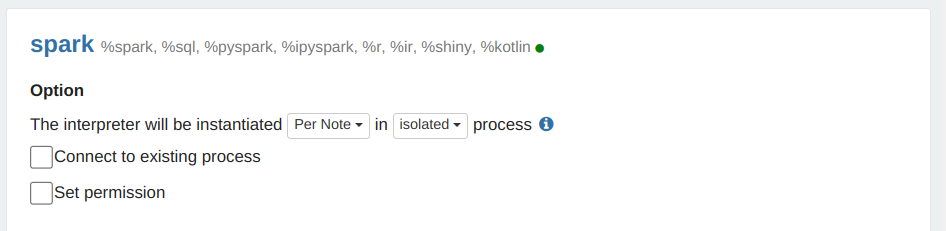

# Установка и обновление пакетов Python на кластерах Data Proc

## 1. Общая информация

При использовании PySpark часто требуется установка дополнительных пакетов Python и обновление версий уже установленных пакетов Python на кластерах [Yandex Data Proc](https://cloud.yandex.ru/services/data-proc). Окружение Python на узлах кластера Data Proc управляется с помощью менеджера пакетов Conda и размещено в каталоге `/opt/conda`.

В отличие от типичных сред "ноутбуков" Jupyter или Zeppelin, активно используемых в среде специалистов по Data Science, кластерная среда Data Proc требует поддержания синхронного состава пакетов и их версий на всех узлах кластера. Кроме того, кластеры Data Proc во многих случаях желательно изолировать от внешних сетей, исключив бесконтрольный доступ в интернет, что затрудняет доступ к стандартным репозиториям пакетов Python.

В целом для решения задачи установки дополнительных пакетов Python рекомендуется следующий подход:

1. для небольших кастомизаций использовать свойства кластера Data Proc в формате `conda:Пакет=Версия` или `pip:Пакет=Версия`;
2. для более сложных случаев использовать подготовленные окружения Python, передавая их в задания PySpark как описано ниже в разделе 2;
3. если требуется сложная кастомизация основного окружения Python в `/opt/conda` на узлах кластера Data Proc, задействовать предлагаемое ниже решение из раздела 3.

Использование предлагаемых вариантов (2) и (3) позволяет решить проблему медленной и ненадёжной установки пакетов Python при помощи инструментов Conda и Pip, особенно при работе с публичными репозиториями, содержащими десятки тысяч пакетов.

## 2. Подготовка и использование виртуальных окружений Python в среде Data Proc

Подготовка виртуальных окружений Python для использования в заданиях PySpark в среде Data Proc имеет некоторые особенности, не очевидные для начинающих пользователей. Описанные ниже шаги обеспечивают успешное создание и последующее использование виртуальных окружений Python в среде Data Proc.

### 2.1. Создание совместимых виртуальных окружений Python

Готовить окружение Python нужно на узле кластера Data Proc - иначе оно не будет совместимым. Для подготовки окружения Python можно создать временный кластер (указав совместимую версию образа), и подключиться к любому из его узлов с помощью SSH от имени пользователя `ubuntu`. Ключ для SSH-доступа указывается при создании кластера.

Шаги подготовки можно взять из [официальной документации Apache Spark](https://spark.apache.org/docs/latest/api/python/user_guide/python_packaging.html#using-virtualenv):

```bash
python -m venv pyspark_venv
source pyspark_venv/bin/activate
pip install pyarrow pandas venv-pack catboost
venv-pack -o pyspark_venv.tar.gz
```

Сформированный файл с образом окружения Python (в примере выше `pyspark_venv.tar.gz`) нужно поместить в бакет Yandex Object Storage. Это можно сделать различными способами, например - скопировать в бакет напрямую с узла кластера Data Proc, на котором этот файл был сформирован, с помощью команды `hdfs`:

```bash
sudo -u hdfs hdfs dfs -copyFromLocal pyspark_venv.tar.gz s3a://dproc-wh/pyenv/pyspark_venv.tar.gz
```

Для выполнения копирования файла у сервисной учётной записи, связанной с кластером Data Proc, должны быть права на запись в соответствующий бакет Yandex Object Storage.

### 2.2. Использование виртуального окружения в среде Yandex DataSphere

Интеграция Yandex DataSphere и Yandex Data Proc основана на использовании компонента [Apache Livy](https://livy.apache.org/) в составе Data Proc.

Для использования виртуальных окружений Python необходимо использовать режим запуска заданий Spark (deploy mode) "cluster", который в варианте интеграции DataSphere через Apache Livy требуется активировать, установив свойство кластера `livy:livy.spark.deploy-mode` в значение `cluster`.

> **Примечание.** При использовании режима "client", который включён по умолчанию в легковесных кластерах Data Proc, процесс-драйвер задания Spark запускается на мастер-узле, в результате чего он не получает доступа к файлам виртуального окружения, размещаемым на вычислительных узлах.

Для использования в задании PySpark, выполняемого на кластере Data Proc и управляемого из DataSphere, подготовленного виртуального окружения Python, необходимо явно создать сессию Livy, передав в неё в качестве параметра путь к файлу образа виртуального окружения в бакете Object Storage.

Пример команды создания сессии Livy с нужными настройками:

```sh
%create_livy_session --cluster DPROC-CLUSTER --id LIVY-SESSION \
  --conf spark.cores.max=4 --conf spark.executor.memory=8g \
  --conf spark.yarn.dist.archives=s3a://BUCKETNAME/pyenv/pyspark_venv.tar.gz#environment \
  --conf spark.yarn.appMasterEnv.PYSPARK_PYTHON=./environment/bin/python
```

В приведённой выше команде:

* `DPROC-CLUSTER` - имя или идентификатор используемого кластера Data Proc;
* `LIVY-SESSION` - произвольная строка, идентификатор сессии Livy в рамках кластера;
* `BUCKETNAME` - имя бакета Object Storage, за которым следует путь к файлу образа виртуального окружения Python;
* `environment` - имя каталога, в который "монтируется" архив виртуального окружения - используется для настройки запуска кастомизированного интерпретатора Python через переменную окружения `PYSPARK_PYTHON`.

Дальнейшее использование созданной сессии Livy выполняется стандартным способом. Зависимости, включённые в состав виртуального окружения, становятся доступны для использования:

```python
#!spark --cluster normal-4a --session dsphere1
from catboost import CatBoostRegressor
#...
```

### 2.3. Использование виртуального окружения в среде интерпретатора Zeppelin

При использовании виртуальных окружений Python наиболее логичным режимом работы контекста Spark выглядит "Per Note / Isolated", поскольку в этом режиме разные блокноты могут задействовать разные виртуальные окружения Python. Пример настроек в UI Zeppelin см. на рисунке ниже.



Настройка переменных сессии Spark в интерпретаторе Zeppelin выполняется с помощью ячейки в режиме `%spark.conf`, которая должна быть выполнена до запуска других операций Spark:

```spark.conf
%spark.conf
spark.submit.deployMode cluster
spark.yarn.dist.archives s3a://BUCKETNAME/pyenv/pyspark_venv.tar.gz#environment
spark.yarn.appMasterEnv.PYSPARK_PYTHON ./environment/bin/python
spark.pyspark.python ./environment/bin/python
```

При выполнении следующей ячейки, использующей Spark (например, ячейки в режимах `%spark` или `%spark.sql`) будет выполнено создание сессии Spark с указанными настройками. В этой сессии можно использовать зависимости, включённые в состав виртуального окружения:

```python
%spark.pyspark
import catboost
print(catboost.__version__)
#...
```

Если при использовании виртуального окружения Python в ноутбуке Zeppelin возникает ошибка вида `TypeError: required field "type_ignores" missing from Module`, то необходимо наложить патч на код Zeppelin, как указано ниже в разделе 4.

## 3. Обновление основного окружения Python в среде Data Proc

Для выполнения синхронного и надёжного обновления основного окружения Python на всех узлах кластера Data Proc предлагается следующий подход:

* Окружение Python с необходимым составом и версиями пакетов готовится на временном кластере Data Proc.
* Полный образ сформированного окружения Python сохраняется в бакете объектного хранилища.
* Сформированное окружение Python автоматически клонируется на узлы рабочих кластеров Data Proc без использования менеджера пакетов.

Предлагаемый подход можно реализовать путём выполнения следующей последовательности шагов:

1. Готовим окружение пакетов Python в `/opt/conda` на узле временного кластера.
2. Формируем сжатый образ файлов из `/opt/conda` в формате `squashfs`, и размещаем образ в бакете объектного хранилища.
3. Готовим скрипт инициализации, осуществляющий скачивание образа из бакета и монтирование его в `/opt/conda` на узлах кластера Data Proc.
4. Только для образа Data Proc 2.0: готовим скрипт инициализации для применения патча к Zeppelin 0.9.0 из-за его несовместимости с обновлениями Python 3.8.
5. Используем подготовленные скрипты инициализации для создания продуктивных кластеров Data Proc.

> **Примечание 1** Окружения Python для образов Data Proc версий 2.0 и 2.1 не совместимы друг с другом из-за различий в версиях системных библиотек. Это ограничение требует подготовки разных образов окружений Python для использования с образами Data Proc 2.0 и 2.1.

> **Примечание 2** На кластере Data Proc, в котором пакеты Python сконфигурированы в соответствии с предлагаемой процедурой, состав установленных пакетов Python не может быть настроен с помощью [описанных в документации](https://cloud.yandex.ru/docs/data-proc/concepts/settings-list#python-packages-install) свойств кластера в формате `conda:Пакет=Версия` и `pip:Пакет=Версия`. Сформированное окружение Python на узлах кластера оказывается доступно только для чтения, что исключает возможность последующей установки или обновления дополнительных пакетов.

### 3.1. Создание среды Python с требуемым составом и версиями библиотек

Для создания среды Python с нужными библиотеками используется временный кластер Data Proc, имеющий доступ в интернет для скачивания дистрибутивов из репозиториев пакетов `conda` и `pip`. Установка необходимых пакетов выполняется в интерактивном режиме, что позволяет уточнить состав необходимых пакетов и их версий и разобраться с возникающими проблемами установки.

Временный кластер может состоять из единственного мастер-узла. Количество выделенных ресурсов мастер-узла определяет скорость выполнения операций подготовки среды Python, некоторые из которых используют все доступные процессорные ядра и чувствительны к объему доступной оперативной памяти. Рекомендуется использование не менее 8 vCPU и 16 Гбайт оперативной памяти.

Ориентировочные параметры временного кластера можно посмотреть в [примере скрипта создания кластера](dp-pyenv-prepare.sh). Перед использованием примера скорректируйте настройки в [файле с опциями](dp-pyenv-options.sh), либо укажите настройки непосредственно в своей копии скрипта создания кластера.

После создания кластера необходимо войти клиентом SSH на мастер-узел кластера от имени пользователя `ubuntu`. Дальнейшие действия должны производиться от имени пользователя `root`, переключение пользователя может быть выполнено с помощью команды `sudo su -`.

> **Примечание.** При выполнении команд, описанных в этом разделе, в случае возникновении ошибок таймаута сетевого доступа к серверам репозиториев Conda необходимо повторить команду, завершившуюся с ошибкой.

Менеджер пакетов Conda перед началом дальнейших действий стоит обновить, это можно сделать следующей командой:

```bash
conda update -c conda-forge -n base --yes conda
```

Опционально можно заменить штатный алгоритм разрешения зависимостей Conda (который работает очень медленно и иногда не может построить план установки) на более современный вариант, [рекомендуемый разработчиками Conda](https://www.anaconda.com/blog/a-faster-conda-for-a-growing-community):

```bash
conda install -c conda-forge -n base --yes conda-libmamba-solver
conda config --set solver libmamba
```

Перед установкой свежих версий пакетов Python иногда целесообразно обновить все уже установленные пакеты, что можно выполнить с помощью следующих команд:

```bash
conda update -c conda-forge --all --yes
```

Далее можно установить необходимые дополнительные пакеты Python, например:

```bash
conda install --yes \
  'catboost>0' \
  'lightgbm>0' \
  'nltk>0' \
  'prophet>0' \
  'seaborn>0' \
  'unidecode>0' \
  'psycopg2>0'
```

При установке можно также указать требования к необходимым версиям пакетов, например:

```bash
conda install -c conda-forge --yes \
  'catboost==1.0.6' \
  'lightgbm==3.2.1' \
  'nltk==3.7' \
  'prophet==1.1.2' \
  'seaborn==0.12.2' \
  'unidecode==1.2.0' \
  'psycopg2==2.9.3'
```

Точный состав использованных (успешных) команд по установке пакетов желательно зафиксировать для последующего воспроизведения конфигурации.

На этом этапе на мастер-узле временного кластера Data Proc в каталоге `/opt/conda` сформировано окружение Python, совместимое с Data Proc и содержащее необходимые версии пакетов.

### 3.2. Формируем сжатый образ файлов окружения

Для формирования образа файлов окружения Python, размещённого в каталоге `/opt/conda`, можно использовать пакет `squashfs-tools`. Его необходимо установить на узел, на котором было подготовлено окружение, путём выполнения команды:

```bash
apt-get install -y squashfs-tools
```

Чтобы поместить все файлы из каталога `/opt/conda` в сжатый файл образа `/CondaImage1.squashfs` можно использовать следующую команду:

```bash
mksquashfs /opt/conda /CondaImage1.squashfs -comp xz
```

В примере команды выше опция `-comp xz` включает использование алгоритма сжатия `xz`, который обычно позволяет создать более компактный файл образа по сравнению с используемым по умолчанию алгоритмом `gzip`.

Сформированный файл образа далее необходимо поместить в бакет объектного хранилища. У сервисного аккаунта, привязанного к временному кластеру Data Proc, должны быть права на запись в этот пакет. Создание каталога в бакете и копирование файла образа можно выполнить с помощью показанных ниже команд:

```bash
sudo -u hdfs hdfs dfs -mkdir s3a://dproc-code/images/
sudo -u hdfs hdfs dfs -copyFromLocal -d /CondaImage1.squashfs s3a://dproc-code/images/
```

На этом этапе подготовленный образ окружения Python был размещён в бакете объектного хранилища. Временный кластер Data Proc можно удалить.

### 3.3. Скрипт скачивания и монтирования образа

Пример скрипта инициализации Data Proc для скачивания и монтирования образа из бакета объектного хранилища [доступен в репозитории](init-conda-squashfs.sh). Ниже приводится разбор выполняемых в скрипте операций.

Полный путь к образу окружения Python передаётся в скрипт через аргумент командной строки. Первоначальное скачивание образа производится скриптом во временный каталог с помощью команды, эквивалентной приведённому ниже примеру:

```bash
sudo -u hdfs hdfs dfs -copyToLocal s3a://dproc-code/images/CondaImage1.squashfs /tmp/
```

Параллельно со скачиванием файла в фоне происходит удаление текущего содержимого каталога `/opt/conda`, что позволяет освободить часть пространства на диске узла Data Proc:

```bash
rm -rf /opt/conda/* &
```

Далее происходит перемещение скачанного файла в корень файловой системы, установка владельца и полномочий.

```bash
mv /tmp/CondaImage1.squashfs /
chown root:root /CondaImage1.squashfs
chmod 444 /CondaImage1.squashfs
```

Для настройки монтирования образа при запуске узла кластера требуется добавить соответствующую запись в файл `/etc/fstab`:

```bash
echo '/CondaImage1.squashfs    /opt/conda    squashfs    ro,defaults    0 0' >>/etc/fstab
```

Далее выполняется монтирование образа:

```bash
mount /opt/conda
```

Подготовленный скрипт инициализации необходимо поместить в бакет объектного хранилища, доступный на чтение для сервисной учётной записи, присваиваемой продуктивным кластерам Data Proc.

### 3.4. Пример обновления основной среды Python на продуктивном кластере Data Proc

При создании продуктивных кластеров Data Proc на основе сформированного окружения Python необходимо:

* обеспечить доступ на чтение бакетов со скриптами инициализации и используемым файлом образа для сервисной учётной записи, присваиваемой кластеру;
* указать скрипты инициализации в настройках кластера, передав в аргументах полный путь к файлу образа и полный путь к исправленному файлу `zeppelin_python.py`.

Возможный пример передачи параметров описан в [примере скрипта создания кластера](dp-pyenv-cluster.sh). Перед использованием примера скорректируйте настройки в [файле с опциями](dp-pyenv-options.sh), либо укажите настройки непосредственно в своей копии скрипта создания кластера.

Проверить работоспособность окружения Python на созданном кластере Data Proc можно с помощью любого задания PySpark. При наличии в кластере сервиса Zeppelin можно воспользоваться встроенным примером ноутбука `Spark Tutorial / Spark SQL (PySpark)`.

## 4. Патч для Zeppelin 0.9.0

Образ Data Proc 2.0 в настоящее время включает в себя Zeppelin 0.9.0, в котором присутствует [проблема совместимости](https://github.com/ipython/ipython/issues/11590), не позволяющая обновить версию Python старше 3.8.0. Первоначально исправление было подготовлено [в рамках проекта IPython](https://github.com/ipython/ipython/pull/11593), и включено в более новые версии Zeppelin в виде файла [`zeppelin_python.py`](https://github.com/apache/zeppelin/blob/master/python/src/main/resources/python/zeppelin_python.py).

В случае обновлении среды Python в Data Proc 2.0 дополнительно требуется обновить файл `zeppelin_python.py` в следующих точках:

* каталоге `/usr/lib/zeppelin/interpreter/python/python`;
* архиве `python-interpreter-with-py4j-0.9.0.jar` в каталоге `/usr/lib/zeppelin/interpreter/python`;
* архиве `spark-interpreter-0.9.0.jar` в каталоге `/usr/lib/zeppelin/interpreter/spark`.

Исправленный файл [`zeppelin_python.py`](https://github.com/apache/zeppelin/blob/master/python/src/main/resources/python/zeppelin_python.py) необходимо разместить в бакете объектного хранилища, доступном для чтения от имени сервисной учётной записи, присвоенной кластеру Data Proc.

Предлагаемый пример скрипта инициализации [`init-patch-zeppelin090.sh`](init-patch-zeppelin090.sh) принимает полный путь к исправленному файлу `zeppelin_python.py` в качестве аргумента (например, `s3a://dproc-code/images/zeppelin_python.py`), и заменяет старые копии этого файла на узле кластера Data Proc. Скрипт необходимо поместить в бакет объектного хранилища, доступный на чтение для сервисной учётной записи, присваиваемой продуктивным кластерам Data Proc.
