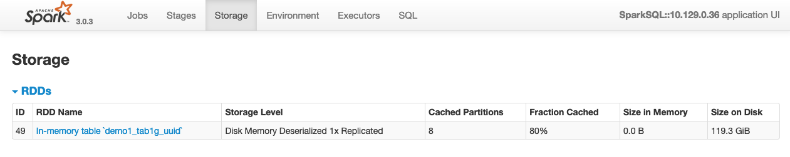
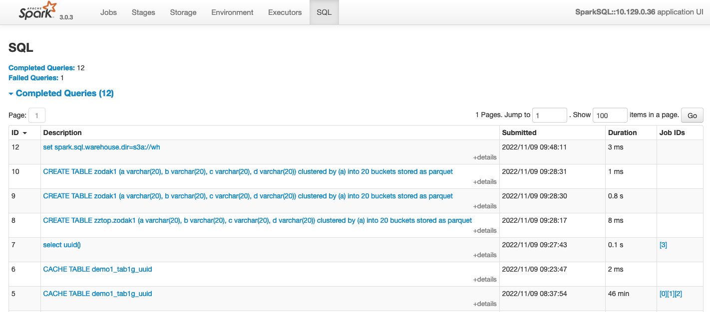
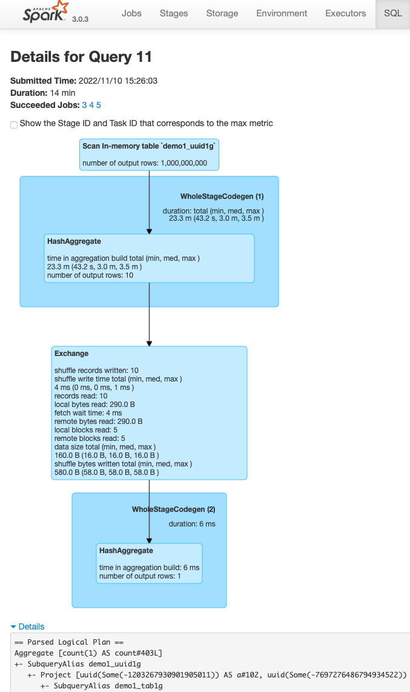

# 1. Общие сведения о выполнении запросов Spark SQL в среде Yandex Data Proc

* В каждый момент времени на кластере может быть запущено несколько приложений (*application*).
* Каждое из приложений может находиться в ожидании, либо выполнять одно или несколько заданий (*job*). Приведённое далее описание относится к определённому виду заданий, а именно заданиям Spark SQL (выполнение SQL запросов средствами Spark).
* Каждое из заданий состоит из набора операций (*task*), которые могут выполняться как параллельно, так и последовательно в зависимости от плана выполнения. Параллельно выполняемые операции группируются в стадии (*stages*).
* Задания, запросы и операции могут находиться в разных состояниях, в том числе - ожидание выполнения, выполнение, завершено успешно, завершено с ошибкой.

В зависимости от настроек (в первую очередь, режима работы планировщика Spark) задания в рамках приложения могут выполняться последовательно (FIFO), либо параллельно (FAIR), при этом параллельное выполнение требует дополнительной настройки на уровне системы и конкретного задания. Обычно удобнее запускать параллельные задания в отдельных приложениях Spark, и ограничиться последовательным выполнением заданий внутри каждого из приложений, во избежание усложнения настроек.

Управление запущенным приложением Spark осуществляется драйвером (*driver*) - специальной программой, которая может быть запущена на одном из узлов кластера (`deploy-mode=cluster`) либо отдельно от кластера (`deploy-mode=client`). Операции выполняются в рамках исполнителей (*executors*), каждый из которых представляет собой программу, запускаемую на одном из узлов кластера и использующую для своей работы определённое количество вычислительных ресурсов (процессорных ядер, оперативной памяти). Количество параллельно запускаемых операций определяется потребностями выполняемых запросов, а также доступными ресурсами кластера.

При использовании стандартных настроек Yandex Data Proc ресурсы выделяются на выполняемые задания динамически, по мере запуска пользователем соответствующих запросов Spark SQL. Существует [ряд настроек](https://spark.apache.org/docs/3.0.3/running-on-yarn.html), влияющих на выделение ресурсов, в том числе влияющих на "размер" драйвера и каждого из исполнителей (выделяемые количество ядер и объём оперативной памяти), и, как следствие, на доступное количество исполнителей в рамках кластера.

Скорость выполнения конкретного запроса зависит от того, какие конкретно вычислительные ресурсы доступны для выполнения его операций, т.е. сколько удалось выделить исполнителей, с учётом потребления всех заданий, запущенных на том же самом кластере.

# 2. Источники диагностической информации по запросам Spark SQL

Для сбора диагностической информации необходим доступ к кластеру Yandex Data Proc, устанавливаемый ролью `dataproc.user` на уровне папки, содержащей соответствующий кластер.

Ссылки на инструменты диагностики представлены на странице информации о кластере (см. рисунок ниже):
1. YARN Resource Manager Web UI - инструмент для просмотра списка и состояния заданий, запущенных на кластере;
2. Spark History Server Web UI - инструмент для просмотра детальной информации о заданиях Spark.

## 2.1 Проверить состав запущенных на кластере приложений

Информация о работающих на кластере приложениях, включая историю выполнения, доступна из интерфейса YARN Resource Manager UI, раздел "Applications", показанном на скриншоте ниже.

Внимание: скриншот широкий (возможно, с горизонтальной прокруткой).

* Для каждого запущенного приложения можно перейти к странице детальной информации (ссылка "Application Master").
* По завершённым приложениям можно просмотреть историческую информацию (ссылка "History").
* По всем отображаемым приложениям можно просмотреть логи (ссылка application_... в левой части скриншота).

Запущенным приложением может быть сессия Spark, созданная из ноутбука Zeppelin, из ноутбука Yandex DataSphere, из интерактивного интерпретатора `spark-sql`, или каким-то другим способом.

Если приложение запланировано к выполнению, но не запущено, можно проверить состояние очередей планирования ресурсов, чтобы определить причину блокировки. Соответствующая информация доступна в разделе "Scheduler", показанном на скриншоте ниже.

Внимание: скриншот широкий (возможно, с горизонтальной прокруткой).

## 2.2 Информация о работающем приложении Spark

### 2.2.1 Общая информация о работающем приложении Spark

Для работающего приложения Spark (например, для открытой сессии Spark, связанной с ноутбуком Zeppelin) детальную информацию можно просмотреть по ссылке "Application Master" из YARN Resource Manager UI, как показано на скриншотах в предыдущем разделе.

Общий вид главной страницы детальной информации о приложении Spark показан на скриншоте ниже.

Доступна следующая информация:
* перечень активных заданий (*Active Jobs*), т.е. в нашем случае Spark SQL запросы, которые работают либо ожидают начала выполнения;
* завершённые ранее задания (*Completed Jobs*);
* время запуска заданий и продолжительность выполнения;
* количество успешно выполненных и запланированных операций (*tasks*).

Если раскрыть раздел "Events Timeline" в верхней части страницы, то можно просмотреть в графическом виде историю выполнения заданий, выделения и освобождения вычислительных ресурсов, как показано на скриншоте ниже.

### 2.2.2 Выделенные ресурсы для работы приложения Spark

Сведения о выделенных для работы приложения Spark вычислительных ресурсов представлены в разделе "Executors" (см. снимок экрана ниже).

Доступна следующая информация:
* количество, состав и состояние исполнителей;
* количество доступных каждому исполнителю процессорных ядер и оперативной памяти;
* количество выполняемых и завершённых операций (*tasks*);
* затраты времени, включая отдельно время сборки мусора (*GC Time*).

Высокая доля времени сборки мусора может свидетельствовать о нехватке оперативной памяти, а также о возможной необходимости использования специальных настроек сборки мусора (например, иногда рекомендуют установить `spark:spark.executor.extraJavaOptions=-XX:+UseG1GC`).

### 2.2.3 Закэшированные данные

Использование оперативной памяти исполнителей для кэширования таблиц можно оценить в разделе "Storage", как показано на скриншоте ниже.

Для каждой таблицы отображается информация об используемой оперативной памяти и пространстве на локальном диске исполнителей, а также прогресс выполнения операции кэширования.

Также по каждой таблице можно просмотреть детализацию со статистикой по разделам таблицы, перейдя по ссылке с именем таблицы.

### 2.2.4 Список SQL выражений

В разделе SQL можно просмотреть перечень выполненных запросов Spark SQL, как показано на скриншоте ниже.

Доступна информация о времени запуска и продолжительности выполнения запроса.

Для каждого запроса можно получить план его выполнения, перейдя по ссылке с текстом запроса.
* План выполнения отображается в графическом виде, что не всегда удобно для передачи информации для диагностики, особенно для больших запросов.
* Текстовый вариант плана запроса можно скопировать из раскрываемой секции "Details", которая размещена под графическим представлением плана, как показано ниже на скриншоте.

Статистика, отображаемая для отдельных операторов на плане выполнения запроса, отражает количество выполненных операций и продолжительность выполнения. Для запросов, выполняемых в момент обращения к плану запроса, показывается актуальная на текущий момент статистика, что позволяет отслеживать детали хода выполнения запроса.

## 2.3 Сбор информации для завершённого приложения Spark

Большая часть информации, доступная для работающего приложения Spark, доступна и для уже завершённых приложений. Доступ к соответствующим данным осуществляется через ссылку "Spark History Server Wev UI" на странице общей информации о кластере Data Proc.

# 3. Ориентировочный порядок первоначальной диагностики производительности запросов

Первичная диагностика проблем с производительностью запросов Spark SQL сводится к следующей последовательности действий:
1. проверке состояния задания, моментов фактического начала и завершения его выполнения;
2. проверке доступных и фактически выделенных вычислительных ресурсов, в виде исполнителей;
3. проверке продолжительности выполнения отдельных операций в рамках запроса, с целью поиска "узких мест";
4. получению и анализу плана выполнения запроса;
5. получению и анализу логов выполнения приложения, для определения возможных сбоев.
