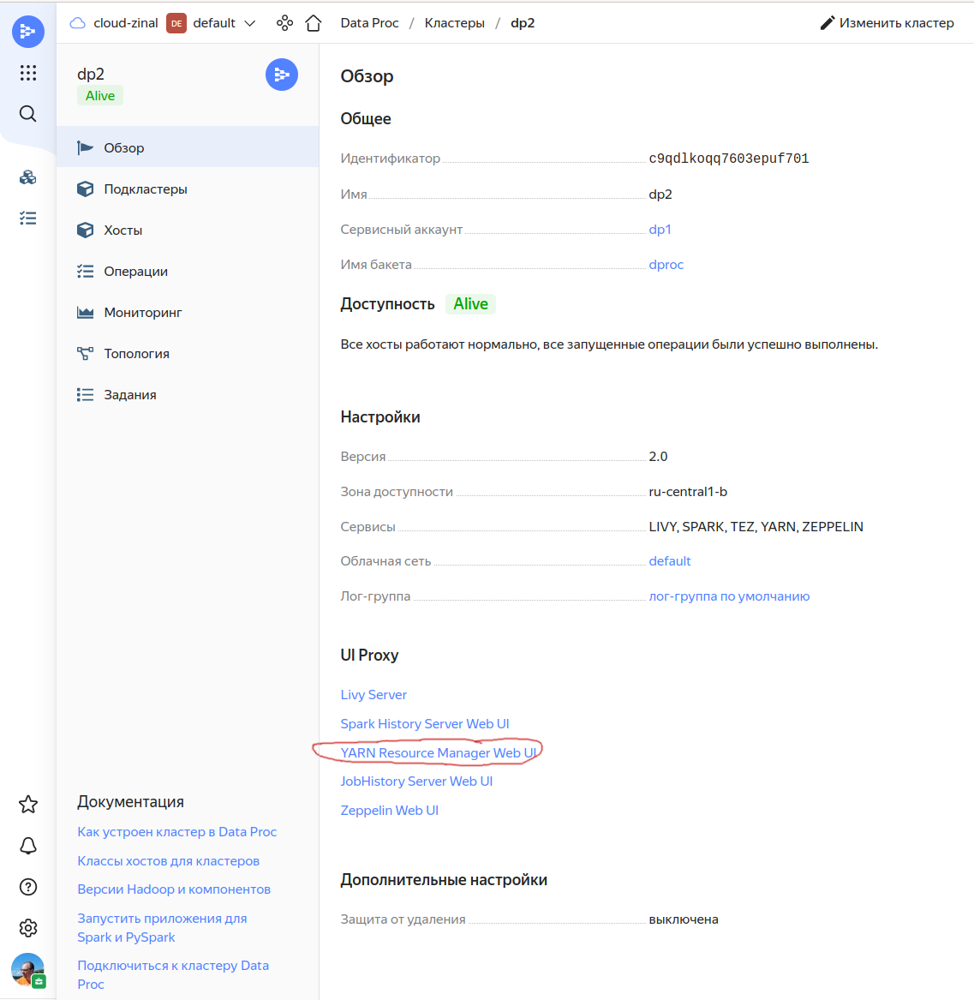

# Сбор диагностической информации о задании Spark в среде Yandex Data Proc

Для сбора диагностической информации необходим доступ к кластеру Yandex Data Proc, устанавливаемый ролью `dataproc.user` 

## Сбор информации для работающего Spark контекста

