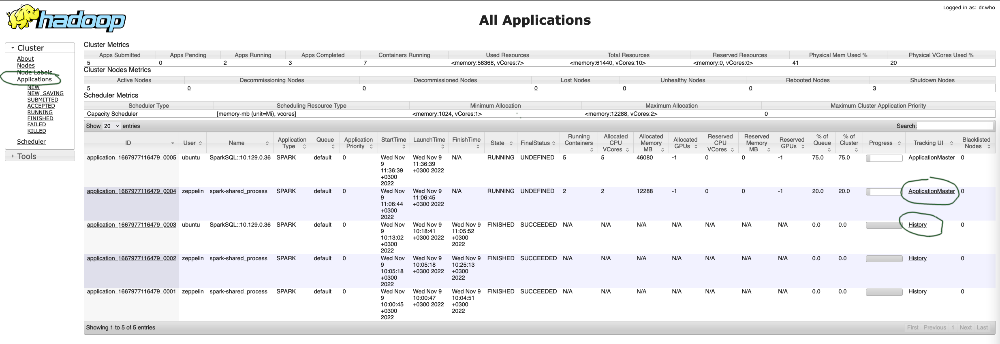

# 1. Общие сведения о выполнении запросов Spark в среде Yandex Data Proc

* В каждый момент времени на кластере может быть запущено несколько приложений (*application*).
* Каждое из приложений может находиться в ожидании, либо выполнять одно или несколько заданий (*job*).
* Каждое из заданий состоит из набора операций (*task*), которые могут выполняться как параллельно, так и последовательно в зависимости от плана выполнения. Параллельно выполняемые операции группируются в стадии (*stages*).
* Задания, запросы и операции могут находиться в разных состояниях, в том числе - ожидание выполнения, выполнение, завершено успешно, завершено с ошибкой.

В зависимости от настроек (в первую очередь, режима работы планировщика Spark) задания в рамках приложения могут выполняться последовательно (FIFO), либо параллельно (FAIR), при этом параллельное выполнение требует дополнительной настройки на уровне системы и конкретного задания. Обычно удобнее запускать параллельные задания в отдельных приложениях Spark, и ограничиться последовательным выполнением заданий внутри каждого из приложений, во избежание усложнения настроек.

Управление запущенным приложением Spark осуществляется драйвером (*driver*) - специальной программой, которая может быть запущена на одном из узлов кластера (`deploy-mode=cluster`) либо отдельно от кластера (`deploy-mode=client`). Операции выполняются в рамках исполнителей (*executors*), каждый из которых представляет собой программу, запускаемую на одном из узлов кластера и использующую для своей работы определённое количество вычислительных ресурсов (процессорных ядер, оперативной памяти). Количество параллельно запускаемых операций определяется потребностями выполняемых запросов, а также доступными ресурсами кластера.

При использовании стандартных настроек Yandex Data Proc ресурсы выделяются на выполняемые задания динамически, по мере запуска пользователем соответствующих запросов Spark SQL. Существует [ряд настроек](https://spark.apache.org/docs/3.0.3/running-on-yarn.html), влияющих на выделение ресурсов, в том числе влияющих на "размер" драйвера и каждого из исполнителей (выделяемые количество ядер и объём оперативной памяти), и, как следствие, на доступное количество исполнителей в рамках кластера.

Скорость выполнения конкретного запроса зависит от того, какие конкретно вычислительные ресурсы доступны для выполнения его операций, т.е. сколько удалось выделить исполнителей, с учётом потребления всех заданий, запущенных на том же самом кластере.

# 2. Источники диагностической информации по заданиям Spark

Для сбора диагностической информации необходим доступ к кластеру Yandex Data Proc, устанавливаемый ролью `dataproc.user` на уровне папки, содержащей соответствующий кластер.

Ссылки на инструменты диагностики представлены на странице информации о кластере (см. рисунок ниже):
1. YARN Resource Manager Web UI - инструмент для просмотра списка и состояния заданий, запущенных на кластере;
2. Spark History Server Web UI - инструмент для просмотра детальной информации о заданиях Spark.


## 2.1 Проверить состав запущенных на кластере приложений

Информация о работающих на кластере приложениях, включая историю выполнения, доступна из интерфейса YARN Resource Manager UI, раздел "Applications", показанном на скриншоте ниже.

Внимание: скриншот широкий (возможно, с горизонтальной прокруткой).



* Для каждого запущенного приложения можно перейти к странице детальной информации (ссылка "Application Master").
* По завершённым приложениям можно просмотреть историческую информацию (ссылка "History").
* По всем отображаемым приложениям можно просмотреть логи (ссылка application_... в левой части скриншота).

Запущенным приложением может быть сессия Spark, созданная из ноутбука Zeppelin, из ноутбука Yandex DataSphere, из интерактивного интерпретатора `spark-sql`, или каким-то другим способом.

Если приложение запланировано к выполнению, но не запущено, можно проверить состояние очередей планирования ресурсов, чтобы определить причину блокировки. Соответствующая информация доступна в разделе "Scheduler", показанном на скриншоте ниже.

Внимание: скриншот широкий (возможно, с горизонтальной прокруткой).


## 2.2 Информация о работающем приложении Spark

### 2.2.1 Общая информация о работающем приложении Spark

Для работающего приложения Spark (например, для открытой сессии Spark, связанной с ноутбуком Zeppelin) детальную информацию можно просмотреть по ссылке "Application Master" из YARN Resource Manager UI, как показано на скриншотах в предыдущем разделе.

Общий вид главной страницы детальной информации о приложении Spark показан на скриншоте ниже.


Доступна следующая информация:
* перечень активных заданий (*Active Jobs*), т.е. в нашем случае Spark SQL запросы, которые работают либо ожидают начала выполнения;
* завершённые ранее задания (*Completed Jobs*);
* время запуска заданий и продолжительность выполнения;
* количество успешно выполненных и запланированных операций (*tasks*).

Если раскрыть раздел "Events Timeline" в верхней части страницы, то можно просмотреть в графическом виде историю выполнения заданий, выделения и освобождения вычислительных ресурсов, как показано на скриншоте ниже.


### 2.2.2 Выделенные ресурсы для работы приложения Spark

Сведения о выделенных для работы приложения Spark вычислительных ресурсов представлены в разделе "Executors" (см. снимок экрана ниже).


Доступна следующая информация:
* количество, состав и состояние исполнителей;
* количество доступных каждому исполнителю процессорных ядер и оперативной памяти;
* количество выполняемых и завершённых операций (*tasks*);
* затраты времени, включая отдельно время сборки мусора (*GC Time*).

Высокая доля времени сборки мусора может свидетельствовать о нехватке оперативной памяти, а также о возможной необходимости использования специальных настроек сборки мусора (например, иногда рекомендуют установить `spark:spark.executor.extraJavaOptions=-XX:+UseG1GC`).

### 2.2.3 Закэшированные данные

Использование оперативной памяти исполнителей для кэширования таблиц можно оценить в разделе "Storage", как показано на скриншоте ниже.


Для каждой таблицы отображается информация об используемой оперативной памяти и пространстве на локальном диске исполнителей, а также прогресс выполнения операции кэширования.

Также по каждой таблице можно просмотреть детализацию со статистикой по разделам таблицы, перейдя по ссылке с именем таблицы.

### 2.2.4 Список SQL выражений

В разделе SQL можно просмотреть перечень выполненных запросов Spark SQL, как показано на скриншоте ниже.


Доступна информация о времени запуска и продолжительности выполнения запроса.

Для каждого запроса можно получить план его выполнения, перейдя по ссылке с текстом запроса.
* План выполнения отображается в графическом виде, что не всегда удобно для передачи информации для диагностики, особенно для больших запросов.
* Текстовый вариант плана запроса можно скопировать из раскрываемой секции "Details", которая размещена под графическим представлением плана, как показано ниже на скриншоте.


Статистика, отображаемая для отдельных операторов на плане выполнения запроса, отражает количество выполненных операций и продолжительность выполнения. Для запросов, выполняемых в момент обращения к плану запроса, показывается актуальная на текущий момент статистика, что позволяет отслеживать детали хода выполнения запроса.

## 2.3 Сбор информации для завершённого приложения Spark

Большая часть информации, доступная для работающего приложения Spark, доступна и для уже завершённых приложений. Доступ к соответствующим данным осуществляется через ссылку "Spark History Server Wev UI" на странице общей информации о кластере Data Proc.

# 3. Ориентировочный порядок первоначальной диагностики производительности запросов

Первичная диагностика проблем с производительностью запросов Spark SQL сводится к следующей последовательности действий:
1. проверке состояния задания, моментов фактического начала и завершения его выполнения;
2. проверке доступных и фактически выделенных вычислительных ресурсов, в виде исполнителей;
3. проверке продолжительности выполнения отдельных операций в рамках запроса, с целью поиска "узких мест";
4. получению и анализу плана выполнения запроса;
5. получению и анализу логов выполнения приложения, для определения возможных сбоев.

# 4. Разбор некоторых типовых ситуаций

## 4.1 Замедление заданий из-за конкуренции за процессор

Для заданий, выполняющих интенсивные вычисления, при настройках YARN по умолчанию возможно размещение слишком большого количества модулей исполнения на одном узле кластера. В конфигурации по умолчанию планировщик YARN при размещении модулей исполнения `executor` учитывает только объём доступной оперативной памяти (логика расчёта реализована в классе `org.apache.hadoop.yarn.util.resource.DefaultResourceCalculator`, используемом как значение по умолчанию для настройки `yarn.scheduler.capacity.resource-calculator`). Это можно исправить, задействовав альтернативный алгоритм расчёта, путём установки указанного ниже свойства на уровне кластера:

```bash
capacity-scheduler:yarn.scheduler.capacity.resource-calculator=org.apache.hadoop.yarn.util.resource.DominantResourceCalculator
```

## 4.2 Ошибки Heartbeat и принудительное отключение узлов исполнения

При выполнении заданий Spark узлы исполнения (executor nodes) регулярно отправляют узлу-драйверу (driver) специальные сообщения Heartbeat, содержащие информацию о состоянии узла исполнения и о прогрессе выполнения текущих операций. Периодичность отправки таких сообщений регулируется параметром `spark.executor.heartbeatInterval` (по умолчанию - 10 секунд). При длительном отсутствии сообщений heartbeat (регулируется параметром `spark.network.timeout`) драйвер считает, что соответствующий узел исполнения неработоспособен, и запрашивает у среды исполнения (в случае Data Proc - у ресурсного менеджера YARN) аварийное завершение неработающего узла.

Причиной отсутствия сообщений heartbeat могут являеться фактическое аварийное завершение или зависание узла исполнения, либо проблемы сетевого взаимодействия в кластере. На практике наиболее частой причиной потерь heartbeat-сообщений являются ситуации исчерпания оперативной памяти на стороне узлов исполнения. Стандартные исключения `java.lang.OutOfMemoryError` для соответствующего узла при этом могут не фиксироваться в логах заданий из-за сбоев при работе протоколирования в условиях нехватки оперативной памяти.

На стороне драйвера события потери связи с узлом-исполнителем из-за длительного отсутствия сообщений Heartbeat фиксируются в логах сообщениями следующего вида:

```
23/02/23 20:22:09 WARN TaskSetManager: Lost task 28.0 in stage 13.0 (TID 242) 
        (rc1c-dataproc-g-f1c1fa-ykeh.mdb.yandexcloud.net executor 5): ExecutorLostFailure 
        (executor 5 exited caused by one of the running tasks) 
        Reason: Executor heartbeat timed out after 138218 ms
```

В логах зависшего узла-исполнителя может не быть никаких сообщений об ошибках. В некоторых случаях фиксируются ошибки `java.lang.OutOfMemoryError` на произвольных участках кода. Кроме того, могут явно фиксироваться ошибки при отправке сообщений Heartbeat (таймаут отправки в методе `Executor.reportHeartBeat()`):

```
23/02/24 09:32:05 WARN Executor: Issue communicating with driver in heartbeater
org.apache.spark.rpc.RpcTimeoutException: Futures timed out after [10000 milliseconds]. 
        This timeout is controlled by spark.executor.heartbeatInterval
	at org.apache.spark.rpc.RpcTimeout.org$apache$spark$rpc$RpcTimeout$$createRpcTimeoutException(RpcTimeout.scala:47)
	at org.apache.spark.rpc.RpcTimeout$$anonfun$addMessageIfTimeout$1.applyOrElse(RpcTimeout.scala:62)
	at org.apache.spark.rpc.RpcTimeout$$anonfun$addMessageIfTimeout$1.applyOrElse(RpcTimeout.scala:58)
	at scala.runtime.AbstractPartialFunction.apply(AbstractPartialFunction.scala:38)
	at org.apache.spark.rpc.RpcTimeout.awaitResult(RpcTimeout.scala:76)
	at org.apache.spark.rpc.RpcEndpointRef.askSync(RpcEndpointRef.scala:103)
	at org.apache.spark.executor.Executor.reportHeartBeat(Executor.scala:1005)
	at org.apache.spark.executor.Executor.$anonfun$heartbeater$1(Executor.scala:212)
	at scala.runtime.java8.JFunction0$mcV$sp.apply(JFunction0$mcV$sp.java:23)
	at org.apache.spark.util.Utils$.logUncaughtExceptions(Utils.scala:2019)
	at org.apache.spark.Heartbeater$$anon$1.run(Heartbeater.scala:46)
	at java.util.concurrent.Executors$RunnableAdapter.call(Executors.java:511)
	at java.util.concurrent.FutureTask.runAndReset(FutureTask.java:308)
	at java.util.concurrent.ScheduledThreadPoolExecutor$ScheduledFutureTask.access$301(ScheduledThreadPoolExecutor.java:180)
	at java.util.concurrent.ScheduledThreadPoolExecutor$ScheduledFutureTask.run(ScheduledThreadPoolExecutor.java:294)
	at java.util.concurrent.ThreadPoolExecutor.runWorker(ThreadPoolExecutor.java:1149)
	at java.util.concurrent.ThreadPoolExecutor$Worker.run(ThreadPoolExecutor.java:624)
	at java.lang.Thread.run(Thread.java:750)
Caused by: java.util.concurrent.TimeoutException: Futures timed out after [10000 milliseconds]
	at scala.concurrent.impl.Promise$DefaultPromise.ready(Promise.scala:259)
	at scala.concurrent.impl.Promise$DefaultPromise.result(Promise.scala:263)
	at org.apache.spark.util.ThreadUtils$.awaitResult(ThreadUtils.scala:293)
	at org.apache.spark.rpc.RpcTimeout.awaitResult(RpcTimeout.scala:75)
	... 13 more
```

Если при выполнении заданий возникают систематические ошибки Heartbeat, и нет других признаков сетевых ошибок, то следует изменить пропорцию между количеством параллельно выполняемых операций и количеством оперативной памяти в сторону большего количества оперативной памяти на одну параллельную операцию. Этого можно добиться, уменьшив количество процессорных ядер в составе узла исполнения (параметр `spark.executor.cores`), увеличив требования по доступной оперативной памяти узла исполнения (параметр `spark.executor.memory`), или используя комбинацию соответствующих настроек.
