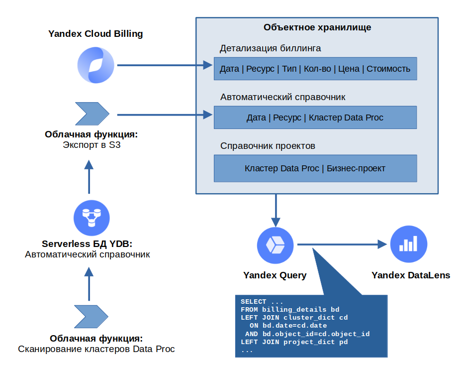

# Пример раскраски динамических вычислительных ресурсов Data Proc метками бизнес-проектов

При создании множества кластеров [Yandex Data Proc](https://cloud.yandex.ru/services/data-proc) в рамках одной папки Yandex Cloud иногда возникает необходимость отнесения затрат на эти кластера к разным бизнес-проектам.

Информация о затратах на сервисы Yandex Cloud с посуточной детализацией доступна из файлов экспорта в формате CSV, которые могут формироваться средствами биллинга Yandex Cloud и сохраняться в объектном хранилище в соответствии с заданными настройками, как описано в [документации биллинга](https://cloud.yandex.ru/docs/billing/operations/get-folder-report). Каждый кластер Data Proc отражается в данных биллинга в виде набора строк, соответствующих выделенным для работы кластера виртуальных серверов и дисков, а также наценке на вычислительные ресурсы за использование управляемого сервиса Data Proc.

Обработка выгруженных в формате CSV данных биллинга может осуществляться с помощью SQL-запросов, выполняемых в среде [сервиса Yandex Query](https://cloud.yandex.ru/docs/query/tutorials/billing), а затем отображаться с помощью [отчетов DataLens](https://cloud.yandex.ru/docs/query/tutorials/datalens).

Для получения по-проектной детализации необходимо сопоставить записи выгрузки со справочником бизнес-проектов, используя следующую цепочку связей:
```
ресурс (виртуальная машина или диск) -> кластер Data Proc -> бизнес-проект.
```

На сегодня (по состоянию на ноябрь 2022 года) данные биллинга не содержат сведений о соответствии динамически создаваемых виртуальных машин или дисков и конкретных кластеров Data Proc. Такую связь пользователи Yandex Cloud могут построить самостоятельно в виде отдельного справочника, автоматически формируемого с помощью бессерверных функций (Cloud Functions), как показано в этом примере.

Сохранив справочник соответствия кластеров Data Proc и принадлежащих им ресурсов на каждые сутки в виде файла в объектном хранилище, средствами Yandex Query можно объединить информацию биллинга с этим дополнительным справочником, и получить в отчётах информацию о затратах на сервис Data Proc в разрезе кластеров. Принадлежность кластеров Data Proc бизнес-проектам можем быть установлена на уровне меток объектов кластеров Data Proc, либо в виде отдельного дополнительного справочника, управляемого пользователями.

## Схема предлагаемого решения

Общая схема решения приведена на рисунке ниже. Стрелки показывают направление информационных потоков.



Необходимые ресурсы Yandex Cloud для работы решения:
* бакет объектного хранилища для размещения справочников и данных экспорта из биллинга;
* [настроенный экспорт данных биллинга](https://cloud.yandex.ru/docs/billing/operations/get-folder-report) Yandex Cloud в бакет объектного хранилища;
* [бессерверная база данных YDB](https://cloud.yandex.ru/services/ydb) для хранения оперативных данных о структуре вычислительных ресурсов кластеров Data Proc;
* [облачная функция](https://cloud.yandex.ru/services/functions) для сканирования структуры ресурсов кластеров Data Proc (одна на каждую папку Облака);
* облачная функция для периодического экспорта результатов сканирования в виде справочника в объектное хранилище;
* сервисная учётная запись, обладающая следующими правами:
    * создание таблиц, чтение и запись данных в используемой базе данных YDB (роль `ydb.editor`, либо эквивалентные права на уровне конкретной БД);
    * доступ к данным о структуре кластеров Data Proc и их вычислительных ресурсов (роль `viewer` для сканируемых папок);
    * запись в используемый бакет объектного хранилища (роль `storage.uploader`, либо права на запись на уровне бакета);
    * запуск облачных функций по расписанию (роль `serverless.functions.invoker` в папке, где установлены функции);
* секрет в [сервисе Yandex Lockbox](https://cloud.yandex.ru/services/lockbox) для хранения статического ключа доступа к объектному хранилищу.

## Установка и настройка решения

Бакет облачного хранилища и бессерверная база данных YDB должны быть предварительно созданы вручную. Документация по созданию ресурсов:
* [создание бакета объектного хранилища](https://cloud.yandex.ru/docs/storage/operations/buckets/create);
* [настройка экспорта данных биллинга](https://cloud.yandex.ru/docs/billing/operations/get-folder-report);
* [создание бессерверной базы данных YDB](https://cloud.yandex.ru/docs/ydb/operations/manage-database#create-db).

Пример команд для создания необходимых облачных функций Yandex Cloud приведён в файле `install.sh`. Пример команд для удаления бессерверных функций есть в файле `cleanup.sh`. Идентификационная информация бакета объектного хранилища и бессерверной базы данных YDB при установке стандартными скриптами указывается в файле `options.sh`.

Стандартные скрипты предполагают, что все объекты существуют в рамках одной папки (folder) Yandex Cloud. Для размещения объектов в разных папках необходима корректировка прав доступа сервисной учётной записи в соответствии с требованиями, перечисленными в разделе со схемой решения.

## Ведение соответствия проектов кластерам Data Proc

Привязка идентификаторов бизнес-проектов к кластерам Data Proc может поставляться в виде внешнего справочника, который должен содержать следующие поля:
* дата действия привязки (опционально, для случая, когда кластер может перемещаться между бизнес-проектами);
* идентификатор кластера Data Proc как объекта Yandex Cloud;
* идентификатор проекта.

Альтернативно привязка кластеров Data Proc к бизнес-проектам может устанавливаться непосредственно средствами Yandex Cloud в виде пользовательской метки на ресурс соответствующего кластера Data Proc, как показано в примере ниже:

```bash
yc dataproc cluster add-labels --name <Кластер> --labels project_id=<МеткаПроекта>
```

В приведённой выше команде:
* <Кластер> - логическое имя кластера Data Proc;
* <МеткаПроекта> - идентификатор, используемый для ссылки на бизнес-проект.

Пользовательские метки доступны в данных биллинга в виде дополнительных колонок формата `label.user_labels.<ИмяМетки>`, и могут использоваться в запросах Yandex Query над экспортированными данными биллинга.

## Облачная функция для сканирования кластеров Data Proc

Для сопоставления вычислительных ресурсов (дисков и виртуальных машин) кластерам Data Proc предлагается использовать бессерверную функцию `cf-scan`, которая выполняет следующие действия:
1. в текущем каталоге (folder) Yandex Cloud находит все кластера Data Proc;
2. для каждого кластера находит все его хосты;
3. для каждого хоста сохраняет соответствие идентификаторов хоста и соответствующего кластера;
4. находит диски каждого хоста;
5. для каждого диска сохраняет соответствие идентификаторов диска, хоста и кластера.

Результатом работы бессерверной функции `cf-scan` является актуализация наполнения таблицы `item_ref` в базе данных YDB. Функцию рекомендуется поставить на расписание (выполнение по таймеру 1 раз в минуту), что обеспечит надёжное обнаружение всех создаваемых кластерами Data Proc вычислительных ресурсов (время жизни хоста Data Proc не может быть менее 2 минут, в том числе при использовании автоматического масштабирования).

[Код облачной функции `cf-scan`](https://github.com/zinal/yc-dataproc-snippets/blob/main/dp-compute-colorizer/cf-scan/cfunc.py).

## Облачная функция для выгрузки справочника в объектное хранилище

Сформированный в виде таблицы базы данных YDB справочник необходимо выгрузить в объектное хранилище для дальнейшего использования средствами Yandex Query.

Примечание: в перспективе сервис Yandex Query будет поддерживать непосредственное обращение к данным YDB, что исключит необходимость выгрузки данных.

Для выполнения выгрузки подготовлена облачная функция `cf-extract`, которая выполняет следующие действия:
1. Определяет текущую и предыдущую даты на основании системного времени.
2. Проверяет наличие изменений в таблице YDB за обрабатываемые даты по сравнению с моментом времени предыдущей выгрузки.
3. При наличии изменений - формирует файл в формате CSV для соответствующей даты, и сохраняет его в указанный бакет объектного хранилища. Если файл уже существует, он перезаписывается.

На каждую дату формируется отдельный файл в бакете объектного хранилища, что позволяет ограничить 

Бессерверную функцию `cf-extract` рекомендуется поставить на расписание (выполнение по таймеру 1 раз в минуту), что обеспечит регулярную актуализацию копии справочника в объектном хранилище.

[Код облачной функции `cf-extract`](https://github.com/zinal/yc-dataproc-snippets/blob/main/dp-compute-colorizer/cf-extract/cfunc.py).

## Пример запроса к данным биллинга

Пример запроса Yandex Query над данными биллинга для разметки позиций затрат кластеров Data Proc метками проектов:

```SQL
SELECT
    COALESCE(y.project_id, '-') AS project_id,
    x.`cloud_name`,
    x.`folder_name`,
    x.`resource_id`,
    x.`service_name`,
    x.`sku_name`,
    x.`date`,
    x.`currency`,
    x.`pricing_quantity`,
    x.`pricing_unit`,
    x.`cost`,
    x.`credit`,
    x.`monetary_grant_credit`,
    x.`volume_incentive_credit`,
    x.`cud_credit`,
    x.`misc_credit`,
FROM bindings.`billing-billing1_billing1-detail/` AS x
LEFT JOIN (
SELECT DISTINCT
    `date`,
    `label.user_labels.cluster_id` AS cluster_id,
    `label.user_labels.project_id` AS project_id
FROM bindings.`billing-billing1_billing1-detail/`
WHERE `label.user_labels.cluster_id` IS NOT NULL
  AND `label.user_labels.cluster_id`<>''
  AND `label.user_labels.project_id` IS NOT NULL
  AND `label.user_labels.project_id`<>''
  AND `date`>=Date('2022-10-01')
  AND `date`<Date('2022-11-01')
) AS y
ON y.cluster_id = x.`label.user_labels.cluster_id` AND y.`date`=x.`date`
WHERE x.`date`>=Date('2022-10-01')
  AND x.`date`<Date('2022-11-01')
;
```
